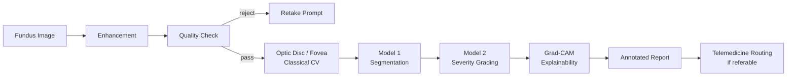

# 👁️ DR Detect

**Explainable AI for Diabetic Retinopathy Screening in Rural India**


> A MATLAB-based screening pipeline that lets a nurse with a portable fundus camera detect and grade diabetic retinopathy on the spot — no ophthalmologist, no internet, no lab required.

---

## 🩺 The Problem

- **77 million** diabetic adults in India — the second-highest burden globally
- **~18%** develop diabetic retinopathy (DR), a leading cause of preventable blindness
- **1 ophthalmologist per 100,000** rural patients
- Early screening prevents **90% of vision loss** — but mass manual screening isn't feasible at this scale

Existing AI screening tools are black boxes, lack clinical validation, and fail on the variable-quality images produced by portable field cameras.

## 💡 The Solution

DR Detect runs the entire screening pipeline **on-device**: a nurse captures a fundus photo, the app enhances it, segments retinal lesions (including neovascularization), grades severity on the ICDR 0–4 scale, and shows *why* via a Grad-CAM heatmap and lesion-level overlays — all before the patient leaves the room.

Packaged as a standalone Windows application via MATLAB Compiler, it runs fully offline, requiring no MATLAB license and no internet connection except for the (in-progress) telemedicine referral step.

## ✨ Key Features

| | |
|---|---|
| 🔍 **Quality gate** | Automatically flags blurry/poorly-lit images before they're graded |
| 🎨 **Adaptive enhancement** | CLAHE, denoising, and color normalization, tuned to work across different camera types |
| 🧬 **Multi-lesion segmentation** | Vessels, microaneurysms/hemorrhages, exudates, and proliferative signs (neovascularization, IRMA, vitreous hemorrhage) — 4 independent channels, not a single blob |
| 📊 **ICDR 0–4 grading** | Severity classification with a calibrated confidence score |
| 🔥 **Grad-CAM explainability** | Visual heatmap showing what the model actually looked at |
| 🖥️ **Offline standalone app** | No MATLAB installation required on the deployment machine |
| 📄 **One-page clinical report** | Original + enhanced image, all lesion overlays, grade, and confidence — reviewable in under 30 seconds |

## 🏗️ Pipeline Architecture



## 🧠 Models

| | Model 1 — Segmentation | Model 2 — Severity Grading |
|---|---|---|
| **Architecture** | DeepLabv3+ with ResNet18 encoder | ResNet50 (transfer learning), fusion rebuild in progress |
| **Output** | 4 channels: vessels, dark lesions, light lesions, proliferative signs | ICDR grade 0–4 + confidence score |
| **Training data** | Refined IDRiD, e-Ophtha, DRIVE (merged via masked multi-label loss) | APTOS2019, IDRiD Disease Grading |
| **Validation** | Held-out image-level split, Dice/IoU per channel | Held-out split; Messidor-2 evaluation pending |

**Why not one model?** Segmentation and grading are different tasks with different failure modes — separating them keeps each output independently interpretable and lets a clinician trust the grade *and* verify it against the actual lesion evidence, not just a single opaque score.

### Current Model 1 results (held-out validation)

| Channel | Dice | IoU | Notes |
|---|---|---|---|
| Vessels | 0.790 | 0.653 | |
| Dark lesions | 0.534 | 0.365 | |
| Light lesions | 0.576 | 0.404 | |
| Proliferative | — | — | Validation set has only 49 positive patches — numbers are noise-dominated and not yet decision-reliable. Documented as a known data-scarcity limitation, not hidden. |

## 🛠️ Tech Stack

- **Platform:** MATLAB (desktop), zero external ML framework dependency
- **Toolboxes:** Image Processing, Computer Vision, Deep Learning, Statistics & Machine Learning, Parallel Computing
- **Deployment:** MATLAB Compiler + MATLAB Runtime (bundled installer, fully offline)
- **Simulink + SimEvents:** district-scale telemedicine capacity planning (separate module)

## 📦 Datasets

| Dataset | Role | Source |
|---|---|---|
| Refined IDRiD | Model 1 primary | [Zenodo, DOI 10.5281/zenodo.18676805](https://doi.org/10.5281/zenodo.18676805) |
| e-Ophtha | Model 1 secondary | [ADCIS](http://www.adcis.net/en/Download-Third-Party/E-Ophtha.html) |
| DRIVE | Model 1 secondary (vessels) | [grand-challenge.org](https://drive.grand-challenge.org/) |
| APTOS 2019 | Model 2 primary | [Kaggle](https://www.kaggle.com/c/aptos2019-blindness-detection) |
| IDRiD Disease Grading | Model 2 secondary | [IEEE DataPort](https://ieee-dataport.org/open-access/indian-diabetic-retinopathy-image-dataset-idrid) |
| Messidor-2 | Model 2 held-out test | [ADCIS](https://www.adcis.net/en/third-party/messidor2/) + [Google-adjudicated grades](https://www.kaggle.com/google-brain/messidor2-dr-grades) |

## 🚀 Getting Started

### For end users (no MATLAB required)
1. Download the latest installer from [Releases](../../releases)
2. Run the installer — it bundles the MATLAB Runtime automatically
3. Launch **DR Detect** and load a fundus image to begin screening

### For developers
```bash
git clone https://github.com/<your-username>/dr-detect.git
cd dr-detect
```
Requires MATLAB R2026a with the toolboxes listed above. Add the repo to your path:
```matlab
addpath(genpath('.'));
savepath;
```

## 📁 Repository Structure

```
dr-detect/
├── functions/        # Classical CV: enhancement, quality check, disc/fovea localization
├── data_prep/        # Dataset preprocessing, patch generation, manifest building
├── models/           # Model training, network construction, custom loss functions
├── pipeline/         # Inference-time pipeline (tiling, stitching, orchestration)
├── explainability/   # Grad-CAM implementation
├── reporting/        # Report generation and PDF export
├── ui/               # Screening app UI (uifigure/uigridlayout)
└── docs/             # Project specification, architecture, and design docs
```

## ⚠️ Known Limitations

Documented honestly rather than hidden — this is a hackathon prototype, not a finished clinical product:

- **Proliferative lesion segmentation** is trained on a small, imbalanced dataset — treat its output as indicative, not conclusive. This does not affect referral accuracy, since the referral decision comes from Model 2's grade, not Model 1's segmentation quality.
- **Telemedicine routing** is currently a local status flag, not a real network transmission — the backend, database, and doctor-facing portal are architected but not yet built (see Roadmap).
- **Model 2's fusion architecture** (combining grading and segmentation features) is in progress; current published metrics are from the standalone baseline.

## 🗺️ Roadmap

- [ ] Complete Model 2 fusion architecture (segmentation-aware grading)
- [ ] Messidor-2 final benchmark evaluation
- [ ] Telemedicine backend + doctor review portal
- [ ] Real-time report status tracking (pending / validated / rejected)
- [ ] Simulink-based district capacity planning module

## 🙏 Acknowledgments

Built for **Smart India Hackathon 2026**, Problem Statement 26038, sponsored by **MathWorks**.

Thanks to the creators and maintainers of Refined IDRiD, e-Ophtha, DRIVE, APTOS 2019, IDRiD, and Messidor-2 for making this research possible.

## 📄 License

This project is submitted for Smart India Hackathon 2026. License to be finalized post-submission.
