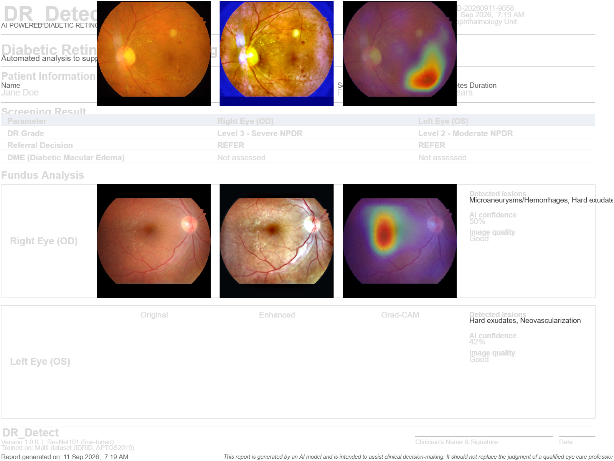
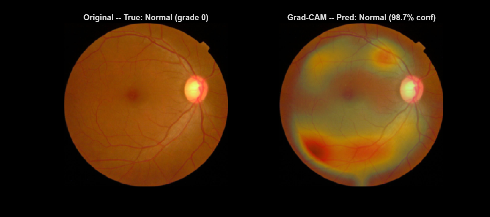
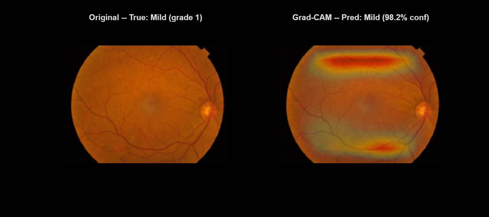
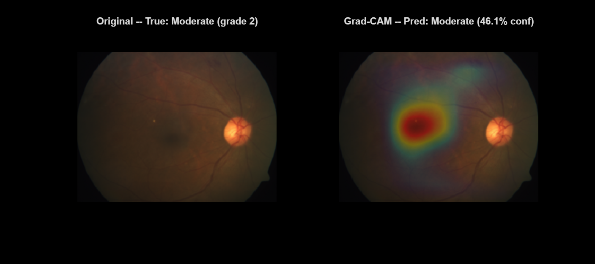
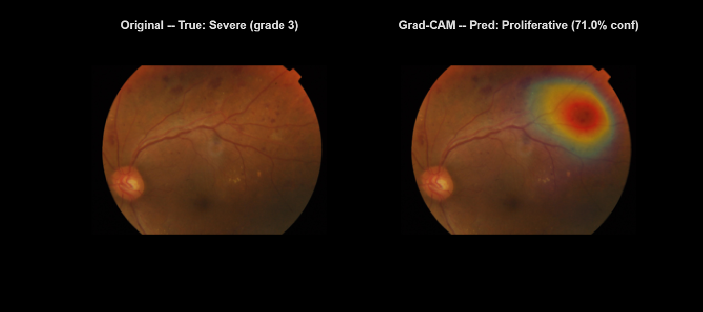
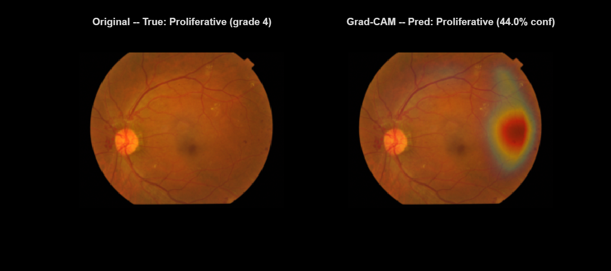
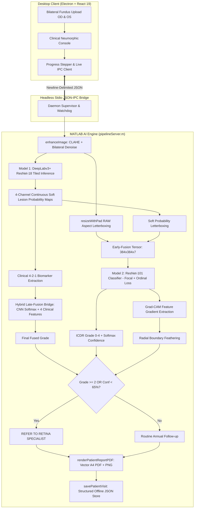

# DR_Detect: AI-Powered Tele-Ophthalmology Screening System

[](https://www.mathworks.com/products/matlab.html)
[](https://electronjs.org/)
[](#-clinical-performance--metrics)
[](#-clinical-performance--metrics)
[](#-clinical-performance--metrics)
[](#-quickstart--deployment)

> **DR_Detect** is a clinical-grade, offline-first diabetic retinopathy (DR) screening system engineered for primary healthcare centers and rural tele-ophthalmology clinics. Combining deep multi-lesion segmentation (DeepLabv3+), 384×384 early-fusion multi-class severity grading (ResNet-101) with Focal + Ordinal loss, a late-fusion Hybrid Feature Bridge encoding the clinical 4-2-1 rule, multi-modal Grad-CAM explainability, and automated single-page A4 diagnostic PDF reports, DR_Detect enables accredited nurses and healthcare workers to identify sight-threatening retinopathy in under 15 seconds without cloud reliance.

---

## 📷 Visual Proof: Clinical Deliverables

### 1. Automated 1-Page A4 Diagnostic Clinical Report
Every bilateral screening automatically produces an archival vector PDF and preview PNG formatted for immediate clinician review and physical signature:

<p align="center">
  
</p>

### 2. Multi-Modal Retinal Attention Heatmaps (Grad-CAM)
Visual attention maps extracted from the final convolutional feature layer of the fused severity network, filtered with radial boundary feathering to suppress zero-padding edge artifacts:

| Grade 0: No DR | Grade 1: Mild NPDR | Grade 2: Moderate NPDR | Grade 3: Severe NPDR | Grade 4: Proliferative DR |
| :---: | :---: | :---: | :---: | :---: |
|  |  |  |  |  |
| *Clear fundus, no active lesion foci* | *Isolated microaneurysm focus* | *Mid-retinal hemorrhages & exudates* | *Multifocal blot hemorrhages* | *Widespread neovascularization* |

---

## 🩺 Clinical Performance & Metrics

### Headline Validation Benchmark (Held-out Split, $N=516$ Images)

| Clinical Diagnostic Metric | DR_Detect v1.1.0 | Previous (v1.0.0) | Standard Benchmark | Clinical Meaning |
| :--- | :---: | :---: | :---: | :--- |
| **Referable DR Sensitivity (Grade $\ge$ 2)** | **97.36%** | 93.39% | >90.0% (SIH PS Target) | **Detects 97.36% of all sight-threatening DR cases needing specialist intervention** |
| **Referable DR Specificity (Grade $\ge$ 2)** | **89.62%** | 88.58% | >85.0% (SIH PS Target) | **Avoids flooding tertiary eye hospitals with non-urgent / healthy patients** |
| **Quadratic Weighted Kappa ($\kappa$)** | **0.8765** | 0.8712 | >0.80 (Substantial Agreement) | Strongly penalizes severe inter-grade misclassifications |
| **Overall 5-Class Exact Accuracy** | **79.46%** | 73.64% | ~78–82% (ResNet-50) | Exact 5-way integer class match across all ICDR levels |

### Why 5-Class Exact Accuracy vs. Binary Triage Matter
* **The Soft Clinical Continuum:** In international screening guidelines (ICDR / WHO), distinguishing **Grade 0 (No DR)** from **Grade 1 (Mild NPDR)** hinges on identifying 1 or 2 isolated microaneurysms ($2\text{--}4$ pixels in width). Even experienced retinal specialists achieve only $60\%\text{--}70\%$ exact inter-grader agreement on borderline cases.
* **Exact vs Triage Scoring:** A model predicting Grade 2 for a patient with Grade 1 receives $0\%$ credit under strict 5-class accuracy, but for clinical screening triage, **both Grade 0 and Grade 1 are Non-Referable**, and **Grades 2, 3, and 4 are Referable**. Because our model's misclassifications occur almost exclusively between adjacent grades ($\kappa = 0.8765$), its **triage sensitivity remains exceptional at 97.36%**.

### Fail-Safe Clinical Triage: Confidence-Based Deferral Gate
To counter rare-class data scarcity (e.g. proliferative neovascularization) and protect rural patients:
* Any prediction with softmax confidence $< 65\%$ automatically triggers an elevated referral:
  ```
  REFER (Low Confidence / Clinical Deferral)
  ```
* Rather than forcing an uncalibrated algorithmic guess on subtle or ambiguous pathology, the patient is flagged for priority telemedicine review.

---

## 🏗️ System Architecture & Data Flow



---

## 🔍 Multi-Modal Explainability

DR_Detect rejects black-box classification by pairing two complementary explainability streams:

1. **Pixel-Level Lesion Verification (Model 1):**
   * DeepLabv3+ segments fundus anatomy into 4 discrete channels:
     * **Channel 1:** Retinal blood vessels
     * **Channel 2:** Dark lesions (*Microaneurysms, Hemorrhages*)
     * **Channel 3:** Light lesions (*Hard Exudates, Cotton Wool Spots*)
     * **Channel 4:** Proliferative lesions (*Neovascularization, IRMA*)
   * Any channel exceeding $0.05\%$ pixel coverage is converted to explicit clinical text printed in the report sidebar.
2. **Gradient-Weighted Saliency (Model 2 Grad-CAM):**
   * Evaluates feature activations at layer `res5c_relu` with respect to the predicted ICDR grade.
   * **Artifact Suppression:** Background fundus borders and letterbox zeros are masked before min-max scaling, and outer margins are smoothly tapered via distance transform (`bwdist`), eliminating false zero-padding edge hotspots.

---

## 📁 Repository Structure

The codebase is organized into 8 modular directories:

```
dr-screening/
├── pipeline/             # Active end-to-end screening pipeline
│   ├── analyzePatientVisit.m     # Bilateral analysis coordinator & deferral logic
│   └── tileAndStitchInference.m  # Feathered overlapping tile reconstruction
├── models/               # Deep learning architectures & training scripts
│   ├── model1_final.mat          # Trained DeepLabv3+ weights (ignored in git)
│   ├── model2_final_weighted.mat # Trained 224px ResNet-101 weights (baseline)
│   ├── model2_final_384.mat      # Trained 384px ResNet-101 weights (v1.1.0)
│   ├── late_fusion_bridge.mat    # Hybrid Feature Bridge stacking model
│   ├── trainModel1.m             # Model 1 masked BCE training routine
│   ├── trainModel2Weighted.m     # Model 2 inverse-frequency weighted training (224px)
│   ├── trainModel2_384.m         # Model 2 384px Focal+Ordinal training
│   ├── trainLateFusionBridge.m   # Late-fusion clinical bridge training
│   ├── focalOrdinalLoss.m        # Focal Loss + Ordinal Distance penalty
│   ├── DRPatchDatastore.m        # Custom datastore for 256x256 patch sampling
│   ├── DRClassificationDatastore.m   # Custom datastore for 224px fusion inputs
│   ├── DRClassificationDatastore_384.m # Custom datastore for 384px fusion inputs
│   └── evaluateAll.m             # Master reproducibility benchmark script
├── explainability/       # Clinical transparency & saliency modules
│   ├── generateGradCAM.m         # ResNet-101 Grad-CAM with boundary suppression
│   ├── generateGradCAMForImage.m # Raw image-to-saliency inference bridge (dynamic resolution)
│   ├── gradCAMDemo.m             # Standalone test runner for heatmaps
│   └── gradcam_samples/          # Pre-computed validation heatmaps (Grades 0-4)
├── reporting/            # Clinical output generation
│   ├── renderPatientReportPDF.m  # A4 vector PDF engine & preview rasterizer
│   ├── savePatientVisit.m        # Offline-first directory visit serializer
│   └── generatePatientReport.m   # Standalone report generator wrapper
├── functions/            # Image normalization & classical vision
│   ├── enhanceImage.m            # CLAHE (Lab space) + bilateral filtering
│   ├── qualityCheck.m            # Laplacian variance blur & illumination check
│   ├── findOpticDisc.m           # Optic nerve head morphological localization
│   └── findFovea.m               # Macular fovea anatomical localization
├── desktop/              # Cross-platform clinical desktop application
│   ├── src/                      # React 19 frontend (Neumorphic clinical design)
│   ├── electron/                 # Node.js main process, preload, and IPC daemon supervisor
│   └── dist_electron/            # Compiled Windows installer (DR-Detect-1.1.0-x64.exe)
├── data_prep/            # Dataset harmonizers & preprocessing
│   └── prepareModel2Data.m       # Merges APTOS 2019 + IDRiD into unified dataset
└── docs/                 # Engineering documentation & architecture specifications
```

---

## 🔁 End-to-End Reproducibility Guide

### 1. Prerequisites
* **MATLAB R2024b or R2026a** with:
  * Deep Learning Toolbox
  * Computer Vision Toolbox
  * Image Processing Toolbox
  * Parallel Computing Toolbox (NVIDIA GPU recommended)
* **Node.js $\ge$ 18.0** & **npm** (for desktop UI)

### 2. Datasets
* **APTOS 2019 Blindness Detection:** [Kaggle Dataset](https://www.kaggle.com/c/aptos2019-blindness-detection/data) (3,662 retinal images).
* **IDRiD (Indian Diabetic Retinopathy Image Dataset):** [IEEE DataPort](https://ieee-dataport.org/open-access/indian-diabetic-retinopathy-image-dataset-idrid) (Disease Grading & Lesion Segmentation sub-challenges).

### 3. Pretrained Weights Download
Due to GitHub's 100MB per-file upload limit, trained `.mat` model weights are excluded from git.
* Place the following inside the `models/` directory:
  * `model1_final.mat` (60.2 MB) — DeepLabv3+ lesion segmentation
  * `model2_final_384.mat` (163.8 MB) — 384px ResNet-101 severity grading (v1.1.0)
  * `late_fusion_bridge.mat` (0.7 MB) — Hybrid Feature Bridge stacking model
  * `model2_final_weighted.mat` (163.8 MB) — 224px baseline (optional, for ablation)
* Direct download mirrors are available under [GitHub Releases / Assets](https://github.com/MayureshJadhao04/dr_detect/releases).

### 4. Reproducing Training & Evaluation
Open MATLAB and execute the automated scripts:

```matlab
% 1. Harmonize dataset into 384x384 aspect-padded images
addpath('data_prep');
prepareModel2Data('D:\DATASETS\model2_384');

% 2. Train Model 1 (DeepLabv3+ ResNet-18)
run('models/trainModel1.m');

% 3. Train Model 2 (384px ResNet-101 with Focal + Ordinal Loss)
run('models/trainModel2_384.m');

% 4. Train Hybrid Feature Bridge (Late-Fusion Clinical Stacking)
run('models/trainLateFusionBridge.m');

% 5. Run master benchmark evaluation to reproduce metrics
run('models/evaluateAll.m');
```

---

## 🚀 Quickstart & Deployment

### Running the Clinical Desktop App
```bash
# Navigate to desktop app directory
cd desktop

# Install dependencies
npm install

# Launch in live development mode (auto-detects MATLAB or compiled dr_backend.exe)
npm run dev

# Or launch standalone desktop application
npm run electron:dev
```

### Running the Backend IPC Daemon Standalone
```bash
# Test daemon protocol and health checks via Node.js
node tests/test_daemon.cjs

# Run full bilateral inference test with real fundus captures
node tests/test_full_analysis.cjs
```

### Building the Production Windows Bundle
```bash
# 1. Compile MATLAB backend into headless executable (inside MATLAB)
>> compile_backend

# 2. Package production installer (.exe) with embedded assets
cd desktop
npm run build:electron
```
The resulting installer `DR-Detect-1.1.0-x64.exe` is generated in `desktop/dist_electron/`.

---

## 👥 Contributors & Acknowledgements
* **Developed for:** Smart India Hackathon (SIH) — Problem Statement PS 26038.
* **Datasets:** Kaggle APTOS 2019 Blindness Detection, IEEE DataPort IDRiD.
* **Frameworks:** MATLAB Deep Learning Toolbox, Electron, React 19, Vite.
